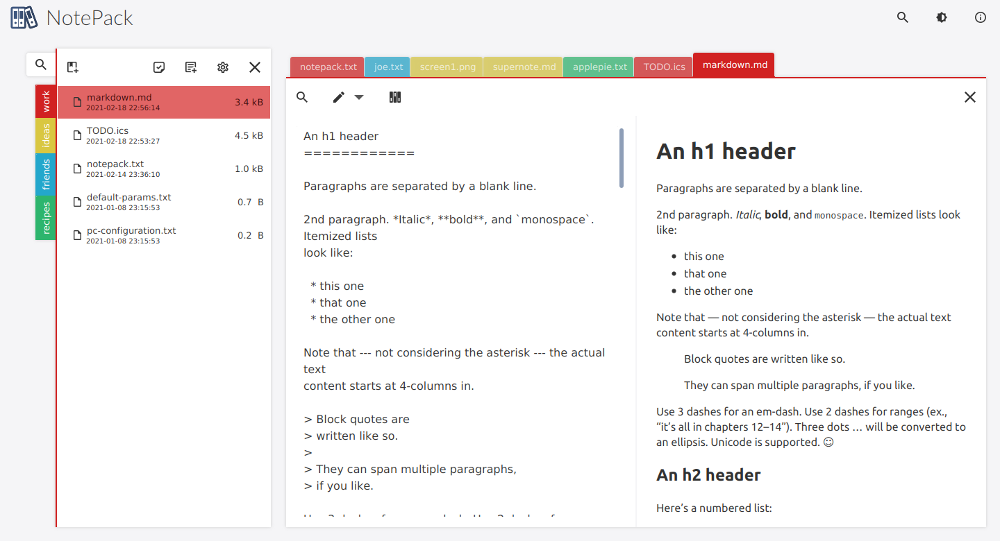
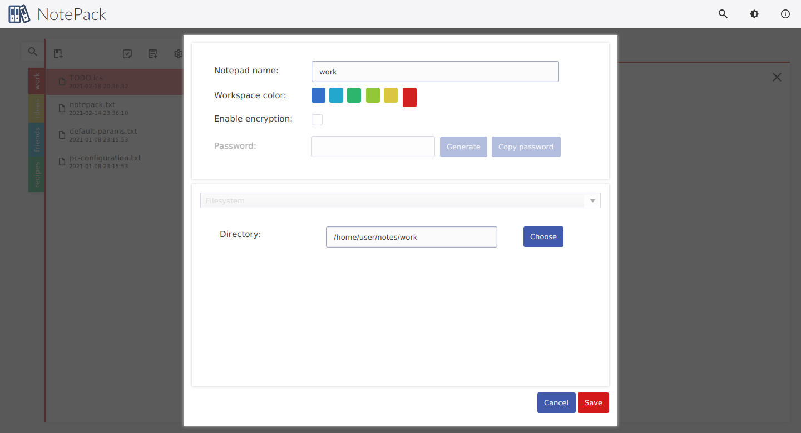
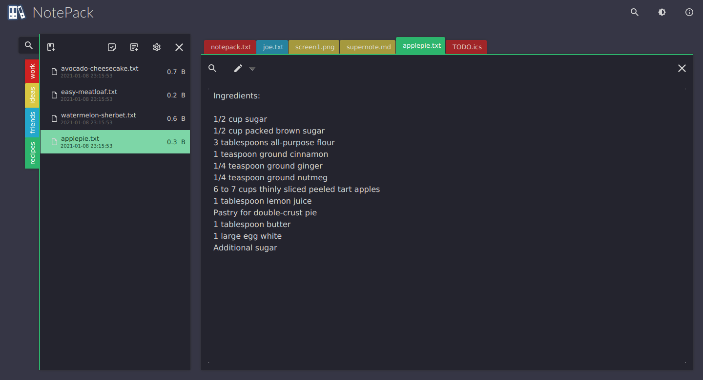
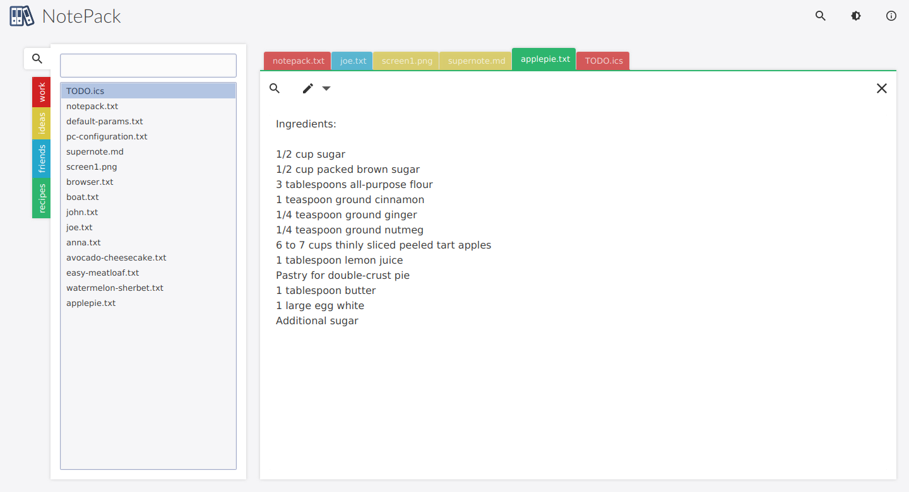
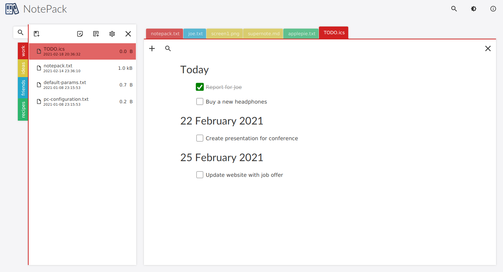
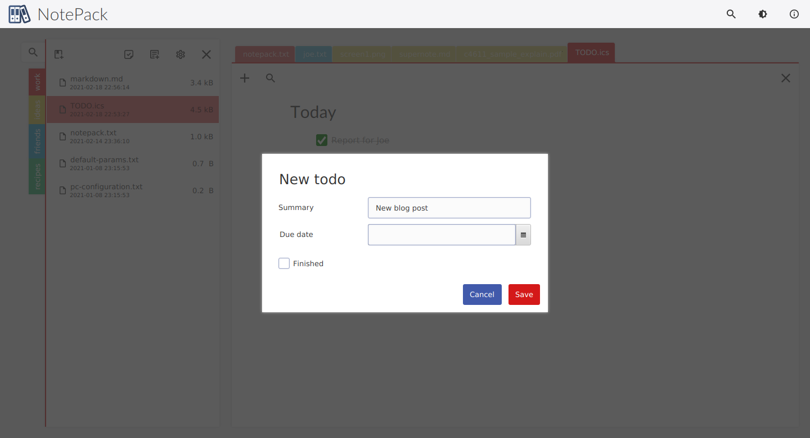
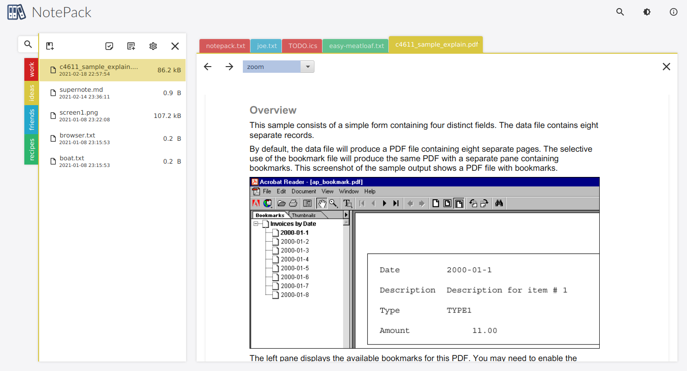

# Notepack

Privacy oriented, without vendor lock in note organizer and todo list desktop application.

## Current release

App is available for: Linux (deb,rpm,AppImage) and Windows

Download from [GitHub release](https://github.com/Ogefest/Notepack/releases)

Documentation is available in [wiki](https://github.com/Ogefest/Notepack/wiki/Documentation)

## Core features

- [privacy by design](https://github.com/Ogefest/Notepack/wiki/Privacy) - no cloud, no accounts, no usage tracking
- [without vendor lock in](https://github.com/Ogefest/Notepack/wiki/No-vendor-lock-in) - all features uses plain files in filesystem structure
- multiple workspaces, multiple notes in workspace
- TODO list support using [iCalendar format](https://en.wikipedia.org/wiki/ICalendar#To-do_(VTODO))
- color highlight for workspaces
- multiple note storage backend, filesystem and WebDav supported right now
- [supported file formats](https://github.com/Ogefest/Notepack/wiki/File-type-supported): plain text, Markdown, PDF, JPG, PNG, ics (calendar files)
- easy note switch using only shortcuts
- minimalist clean layout
- [encryption](https://github.com/Ogefest/Notepack/wiki/Encryption) using zip AES algorithm (note packed as zip archive with password protected)

## Screenshots

### Main window

### New workspace

### Dark theme

### Search for notes

### Tasks

### PDF Support

